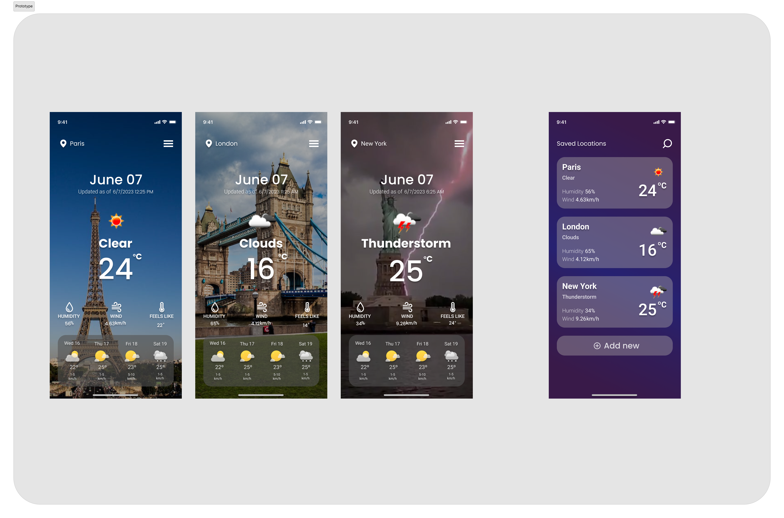
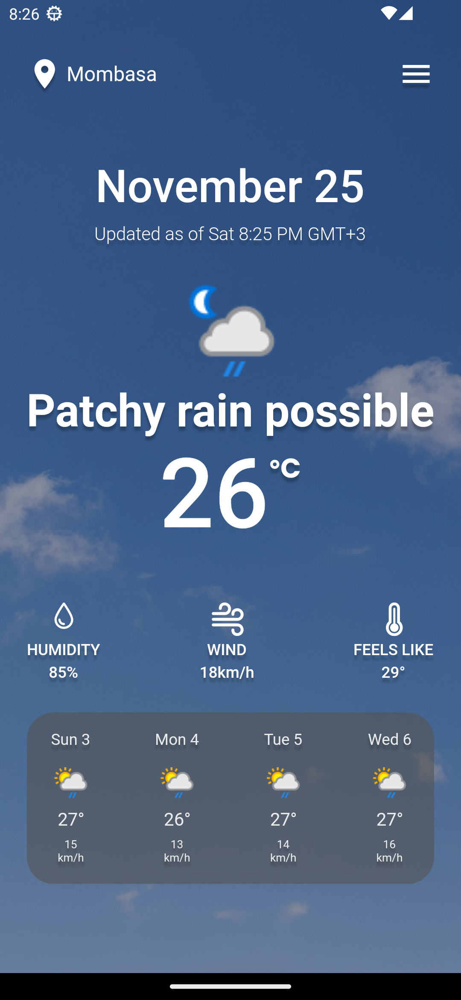
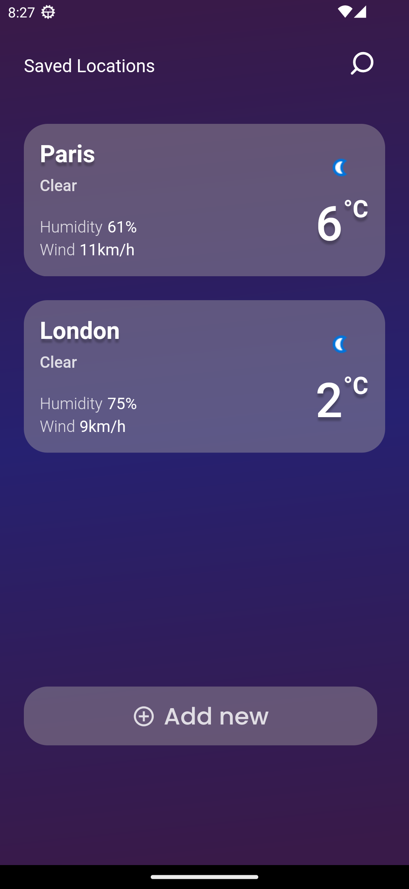
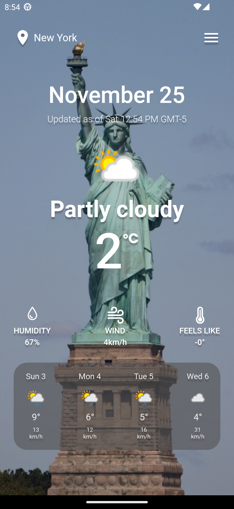
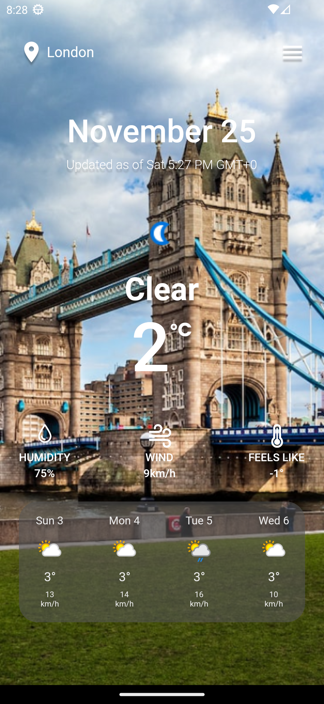
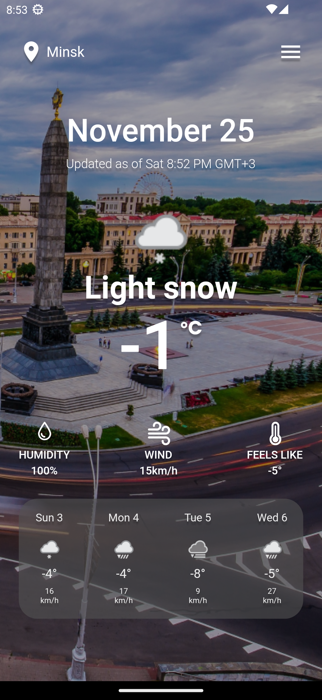
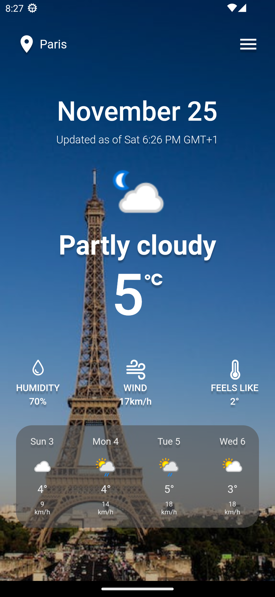
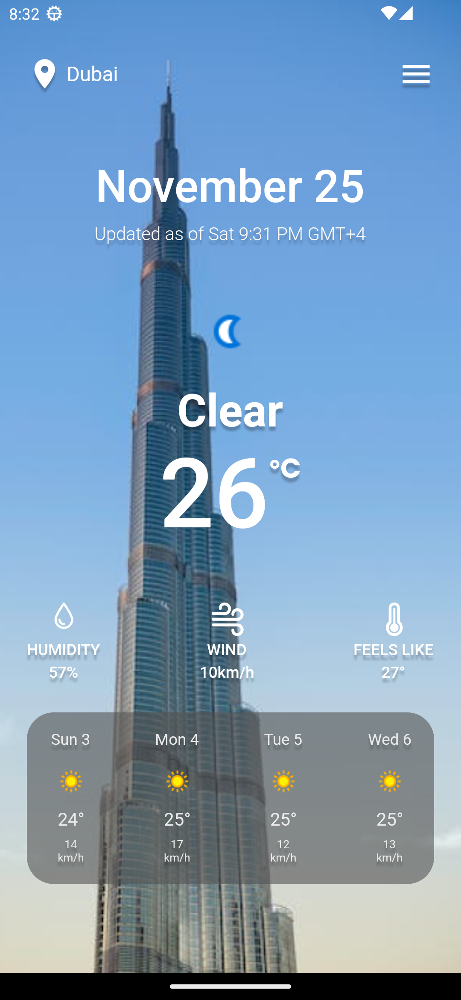
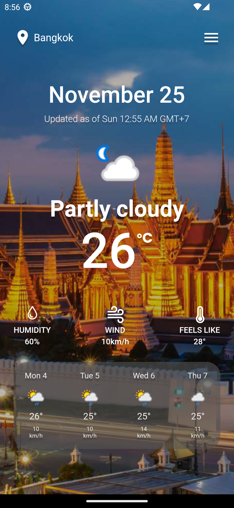

# Weather App Contest

<a href=""></img></a>

A real-time weather application based on the current location of the user or different searchable locations. 

### Language & Tools used:
- Flutter & Dart
- Weatherapi - Real-time weather data API
- Riverpod  - State management

### Demo
Take a look at the [App apk](https://drive.google.com/file/d/1i5PJy3TuSRcBuHyzrdvjXspaCNYlOKJm/view?usp=sharing)

<!-- >**This is only a simulation of the mobile user experience from your laptop, desktop or tablet.** -->

### Screenshot
| Home                                         | Saved List                                   | Search                                       |
| -------------------------------------------- | -------------------------------------------- | -------------------------------------------- |
|  |  |  |

| New York                                     | London                                       | Minsk                                        |
| -------------------------------------------- | -------------------------------------------- | -------------------------------------------- |
|  |  |  |

| Paris                                        | Dubai                                        | Bangkok                                      |
| -------------------------------------------- | -------------------------------------------- | -------------------------------------------- |
|  |  |  |

## weatherapi
- Head over to [weatherapi](https://www.weatherapi.com/) and sign up
- After login create an API key 
- Create a file named `api_key.dart` under `lib/auth/`
- Add the line below
  
  >**const weatherApiKey = 'YOUR_API_KEY_FROM_WEATHER_API';**
  
- hit flutter run on the selected emulator/device

## Credits
- [heyFluter.com](https://heyflutter.com/)
- [Figma Design Template](https://www.figma.com/file/muEpuBiF0CM0yoLPm0wYRj/Weather-App-Design-Templates-(Community)?type=design&node-id=30-265&mode=design)
- Launcher Icon : <a href="https://www.flaticon.com/free-icons/sun" title="sun icons">Sun icons created by kawalanicon - Flaticon</a>
